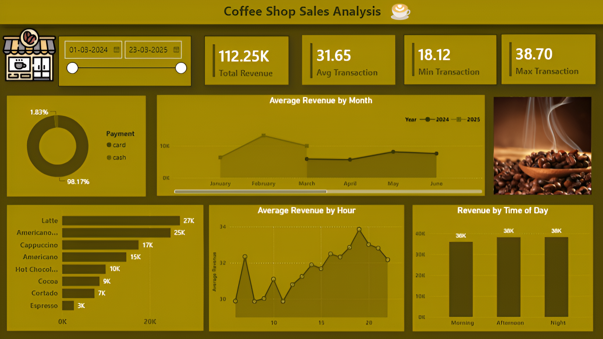

# Coffee-Shop-Sales-Analysis-Power-BI
Power BI dashboard for analyzing coffee shop sales and revenue trends

## Project Overview
An interactive Power BI dashboard created to analyze coffee shop sales performance and identify important business trends.

## Dashboard

## Key Insights
- Total Revenue
- Average Transaction Value
- Minimum and Maximum Transaction
- Revenue by Month
- Revenue by Hour
- Revenue by Time of Day
- Payment Method Analysis
- Coffee Product Sales Analysis

## Tools Used
- Power BI
- Power Query
- DAX
- Excel / CSV

## Dashboard Features
- Interactive date filter
- Revenue KPIs
- Monthly revenue analysis
- Hourly sales analysis
- Time-of-day analysis
- Payment method distribution
- Product-wise revenue analysis

## Project Files
- `Coffee_Shop_Sales.pbix` – Power BI dashboard
- `dashboard.png` – Dashboard preview
-  `Coffee_sales.csv` – CSV File

## Author
Disha Singh
